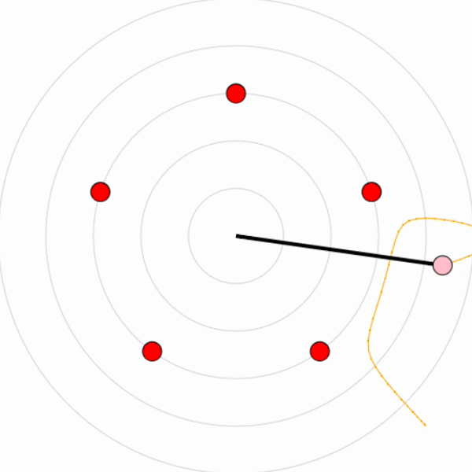

# Chaotic Magnetic Super Pendulum
try a live version [here](http://is.gd/McPhysics)

Physicists have always been fascinated by pendulums, and with good reason. They are very simple systems that can be easily understood, yet still have applications in almost all fields of physics. While they might be nothing more than a mass at the end of a string, modeling their movement has been used to solve many problems, from keeping time inside clocks to understanding quantum mechanics!

This all changes, however, when a magnet is applied at the end of such pendulums. Indeed, this transforms an object that is otherwise completely understood into a concrete example of the butterfly effect. This effect can be summarized as "small causes can have large consequences". This idea ties into a much broader and complex concept of mathematics: chaos theory.

This simulation features the physics behind a magnetic pendulum. Notice how modifying any setting or initial magnet location (even slightly) might result in changing the magnet over which the pendulum might end in an unpredictable manner. This is the butterfly effect! Try adding other magnets and changing the polarities to simulate the interesting motions of the pendulum.

## Made by:
* [Amir Bawab](https://ca.linkedin.com/in/amirbawab)
* [Félix Léger](https://ca.linkedin.com/in/felleg)
* [Justin Léger](https://ca.linkedin.com/in/legerjustin)

## Future improvements:
* Add Slider that determines number of magnets in the field
* Add a button that adds a second pendulum (pendulums don't interact with each other), see effect of chaos theory
* Allow to remove magnets
* Make magnet movement and polarity double-click compatible with mobile

